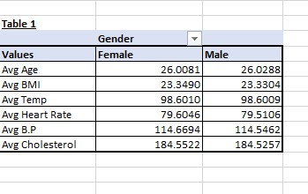
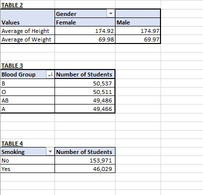
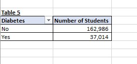
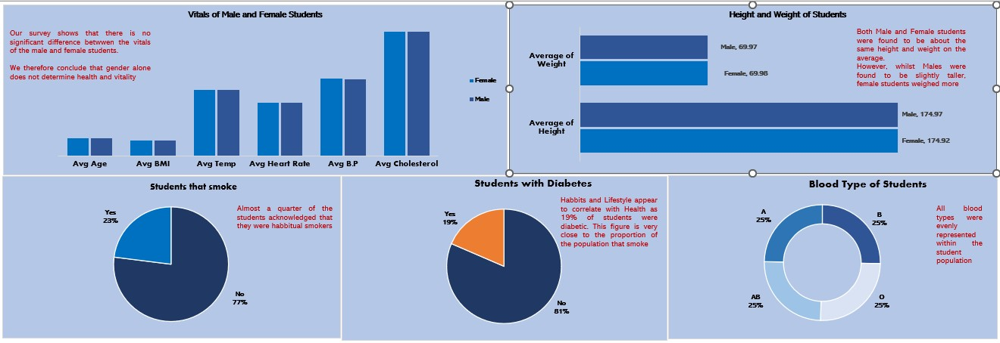

# Medical-Research-Demo
## INTRODUCTION
As part of my second task on Data Analysis and Visualization with Promise Chinonso, i used hypothetical data collected from medical students to demonstrate which Gender or lifestyle has a more significant impact on the occurrence of chronic diseases like Diabetes. 
## PROBLEM STATEMENT
To investigate whether Lifestyle and, or Gender are risk factors in occurence of chronic ailments like Diabetes
## DATA SET
### DATA SOURCING
A rough hypothetical dataset of two thousand students that requiredD data Cleaning and Manipulation was provided. It included the following 
Student ID, Age, Gender, Height, weight, blood type, BMI, Temperature, Heart rate, Blood Pressure, and Cholesterol levels of students. We also collected their lifestyle regarding their smoking habbits and their health records to note those who were Diabetic.
### DATA TRANSFORMATION
As stated earlier, the dataset was quite dirty and required manipulation on Microsoft Excel to clean the data
## SKILLS DEMONSTRATED
i.  Data manipulation on Microsoft Excel Using MAX and MIN Functions, COUNT Functions and PIVOT TABLES
ii. Data Visualization on Microsoft Excel Using Column Cahrts, Bar Charts, Pie Charts, and Doughnut Charts

## ANALYSIS AND VISUALIZATIONS

## CONCLUSION
From the analysis of cross sectional data consisting of Bio data, medical records and lifestyle records of male and female students between the ages of 18 to 34 years, we established that gender does not make a significant contribution to the long term health of individuals. Rather, lifestyle and habbits are more likely to contribute to occurence of chronic diseeases like Diabetes  
## RECCOMENDATION
Lifestyle Changes are required to reduce the prevalence of Diabetes and other chronic ailments. Smoking in particular should be discouraged through more advocacy and public enlightenment. In fact, Government should increase tax on tobacco companies to raise more revenue for public health infrastrucure while discouraging Tobacco production
